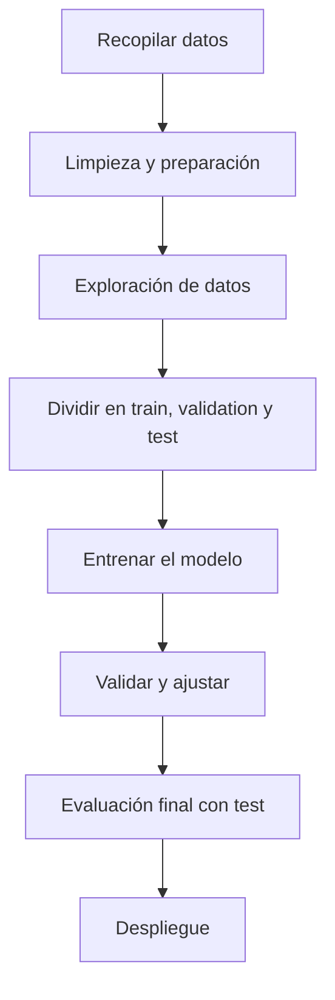
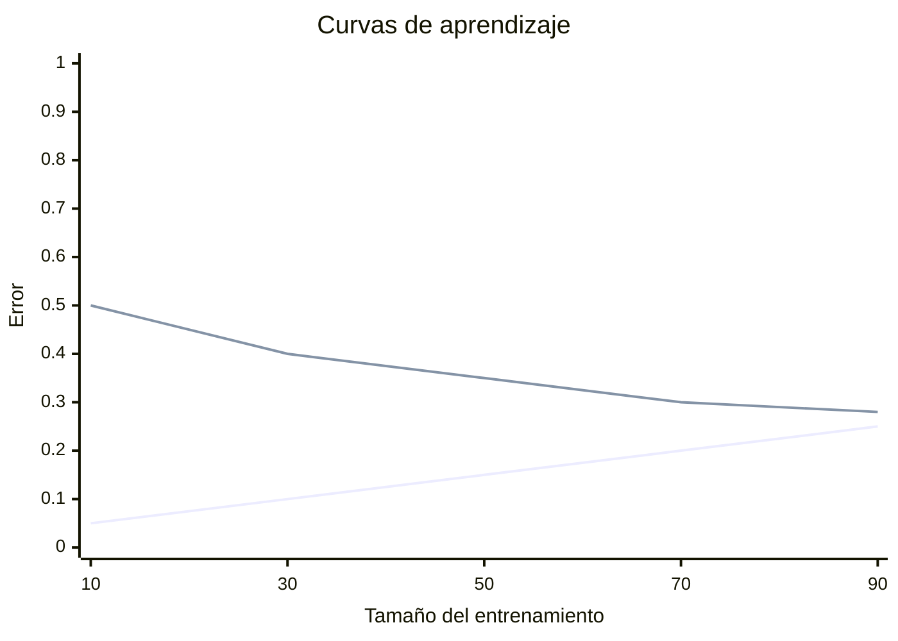

# Actividad Autónoma 2

## Principios de modelado y validación en Machine Learning

**Asignatura:** Machine Learning  
**Unidad:** 1  
**Tema:** Modelado y validación  
**Archivo base:** AA U1T2-ML1.pdf

## Introducción

En Machine Learning no basta con entrenar un modelo y asumir que funcionará bien en cualquier caso. Primero se deben preparar los datos, elegir una estrategia de entrenamiento, medir el desempeño con métricas adecuadas y, finalmente, validar si el modelo realmente generaliza. En esta actividad se explican esas etapas y se resuelven ejercicios básicos de clasificación, regresión y validación cruzada.

## 1. Etapas principales de un proyecto de aprendizaje automático

Un proyecto de Machine Learning normalmente sigue estas etapas:

1. **Recopilación de datos.** Se reúnen los datos que representan el problema que se quiere resolver.
2. **Limpieza y preparación.** Se corrigen errores, se tratan valores faltantes y se transforma la información para que el modelo pueda usarla.
3. **Exploración de datos.** Se analizan patrones, distribuciones y relaciones entre variables.
4. **Separación del conjunto de datos.** Se divide la información en entrenamiento, validación y prueba.
5. **Entrenamiento del modelo.** El algoritmo aprende a partir de los datos de entrenamiento.
6. **Validación.** Se revisa si el modelo funciona correctamente con datos no vistos.
7. **Ajuste de parámetros.** Se hacen cambios para mejorar el rendimiento.
8. **Prueba final.** Se evalúa el modelo con datos de prueba para estimar su desempeño real.
9. **Despliegue.** Si el modelo es útil, se pone en uso.

En palabras simples, el objetivo es construir un modelo que no solo memorice los datos, sino que también funcione bien con información nueva.

## 2. Diagrama de flujo del proceso



## 3. Matriz de confusión

La matriz dada es la siguiente:

| | Predicho positivo | Predicho negativo |
| --- | ---: | ---: |
| Real positivo | 40 | 10 |
| Real negativo | 20 | 30 |

De aquí obtenemos:

- **TP = 40**
- **FN = 10**
- **FP = 20**
- **TN = 30**

### a) Accuracy

$$
Accuracy = \frac{TP + TN}{TP + TN + FP + FN}
$$

$$
Accuracy = \frac{40 + 30}{100} = 0.70
$$

**Resultado:** 70%

### b) Precision

$$
Precision = \frac{TP}{TP + FP}
$$

$$
Precision = \frac{40}{40 + 20} = 0.6667
$$

**Resultado:** 66.67%

### c) Recall

$$
Recall = \frac{TP}{TP + FN}
$$

$$
Recall = \frac{40}{40 + 10} = 0.80
$$

**Resultado:** 80%

### d) F1-score

$$
F1 = \frac{2 \cdot Precision \cdot Recall}{Precision + Recall}
$$

$$
F1 = \frac{2 \cdot 0.6667 \cdot 0.80}{0.6667 + 0.80} \approx 0.7273
$$

**Resultado:** 72.73%

### e) Interpretación

El modelo tiene un desempeño aceptable, pero no es completamente equilibrado. Detecta bastante bien los casos positivos, porque su recall es alto, pero también comete varios falsos positivos, lo que baja la precision. En otras palabras, el modelo encuentra la mayoría de los positivos, aunque no siempre acierta cuando predice una clase positiva.

## 4. Cálculo en regresión: RMSE

Valores reales: `[3.0, 2.5, 4.0, 5.0]`  
Valores predichos: `[2.8, 2.7, 4.2, 4.5]`

### Cálculo paso a paso

| Real | Predicho | Error | Error cuadrado |
| --- | ---: | ---: | ---: |
| 3.0 | 2.8 | 0.2 | 0.04 |
| 2.5 | 2.7 | -0.2 | 0.04 |
| 4.0 | 4.2 | -0.2 | 0.04 |
| 5.0 | 4.5 | 0.5 | 0.25 |

$$
MSE = \frac{0.04 + 0.04 + 0.04 + 0.25}{4} = 0.0925
$$

$$
RMSE = \sqrt{0.0925} \approx 0.3041
$$

**Resultado:** RMSE ≈ 0.3041

### Interpretación

El valor del RMSE indica que, en promedio, las predicciones del modelo se desvían alrededor de 0.30 unidades respecto a los valores reales. Mientras más pequeño sea este valor, mejor ajuste tiene el modelo.

## 5. División train/validation/test

La división de datos cumple una función muy importante:

- **Train:** se usa para que el modelo aprenda.
- **Validation:** se usa para ajustar hiperparámetros y comparar versiones del modelo.
- **Test:** se reserva para medir el desempeño final sin influir en el entrenamiento.

Esta separación es importante porque evita que el modelo se evalúe con los mismos datos con los que aprendió. Si eso pasara, el resultado sería demasiado optimista.

## 6. Importancia de estratificar en clasificación desbalanceada

Cuando una clase aparece mucho más que la otra, dividir los datos sin cuidado puede hacer que una partición quede con muy pocos ejemplos de la clase minoritaria. La estratificación evita ese problema porque mantiene proporciones similares de cada clase en cada subconjunto.

En resumen, estratificar ayuda a que la evaluación sea más justa y representativa.

## 7. Diferencia entre k-fold cross validation y stratified k-fold

- **k-fold cross validation:** divide los datos en $k$ partes y rota cuál se usa para validar.
- **Stratified k-fold:** hace lo mismo, pero conserva la proporción de clases en cada partición.

La segunda opción es mejor cuando se trabaja con clasificación, especialmente si los datos están desbalanceados.

## 8. Ejemplo numérico sencillo de validación cruzada

Supongamos 10 datos:

`[D1, D2, D3, D4, D5, D6, D7, D8, D9, D10]`

Si los dividimos en 5 particiones, quedan así:

- Fold 1: `D1, D2`
- Fold 2: `D3, D4`
- Fold 3: `D5, D6`
- Fold 4: `D7, D8`
- Fold 5: `D9, D10`

Entonces se realizan 5 rondas:

1. Se valida con Fold 1 y se entrena con los otros 4.
2. Se valida con Fold 2 y se entrena con los demás.
3. Se valida con Fold 3.
4. Se valida con Fold 4.
5. Se valida con Fold 5.

Al final se promedian los resultados. Así se obtiene una evaluación más estable que usando una sola división.

## 9. Sobreajuste y subajuste

### a) Sobreajuste (overfitting)

Un modelo está sobreajustado cuando aprende demasiado bien los datos de entrenamiento, incluyendo ruido o patrones irrelevantes. En ese caso, funciona muy bien con entrenamiento, pero falla con datos nuevos.

### b) Subajuste (underfitting)

Un modelo está subajustado cuando es demasiado simple y no logra capturar la relación real entre las variables. Entonces rinde mal tanto en entrenamiento como en prueba.

## 10. Curvas de aprendizaje



En un caso de sobreajuste, el error de entrenamiento es bajo y el de validación es más alto. En un caso de subajuste, ambos errores se mantienen altos.

## 11. Apoyo en Python para los cálculos

```python
def confusion_metrics(tp, tn, fp, fn):
    accuracy = (tp + tn) / (tp + tn + fp + fn)
    precision = tp / (tp + fp)
    recall = tp / (tp + fn)
    f1 = 2 * precision * recall / (precision + recall)
    return accuracy, precision, recall, f1


def rmse(real, pred):
    mse = sum((r - p) ** 2 for r, p in zip(real, pred)) / len(real)
    return mse ** 0.5


tp, tn, fp, fn = 40, 30, 20, 10
print(confusion_metrics(tp, tn, fp, fn))

real = [3.0, 2.5, 4.0, 5.0]
pred = [2.8, 2.7, 4.2, 4.5]
print(rmse(real, pred))
```

## Conclusión general

Esta actividad muestra que Machine Learning no consiste solo en entrenar un algoritmo. También exige preparar bien los datos, elegir métricas apropiadas y validar correctamente el modelo. Las métricas de clasificación, el RMSE en regresión y la validación cruzada son herramientas básicas para saber si un modelo realmente es útil y si puede generalizar a datos nuevos.

## Resultados finales

- Accuracy: **0.70**
- Precision: **0.6667**
- Recall: **0.80**
- F1-score: **0.7273**
- RMSE: **0.3041**
- Modelo más equilibrado: **aceptable, pero con más errores de falsos positivos que de falsos negativos**