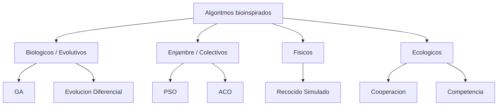
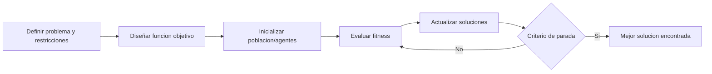
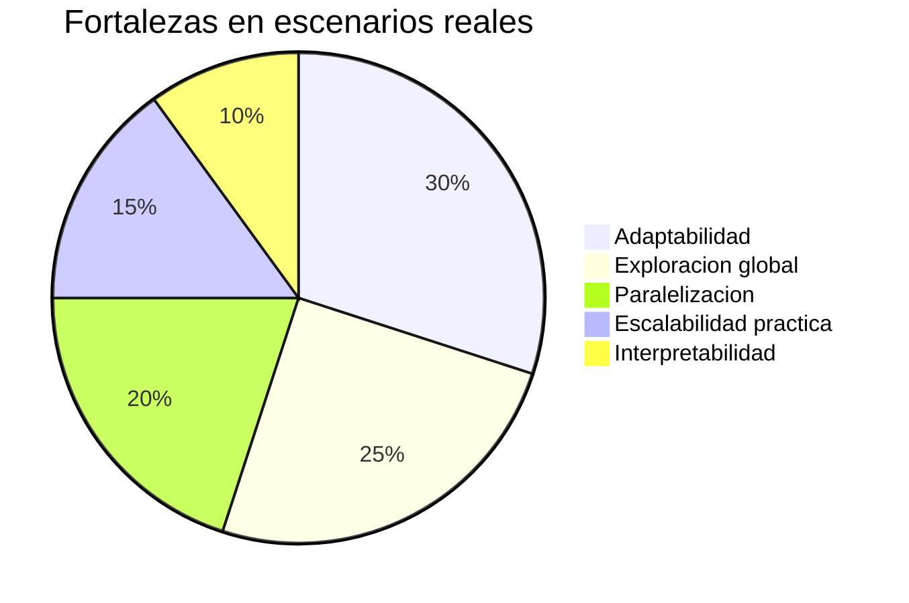

# AA1CDIA-METAHEURISTICA-U1T1 - Resolucion propuesta

## 1) Resumen conceptual

Los algoritmos bioinspirados son metodos de optimizacion que toman ideas de procesos naturales para resolver problemas complejos donde no es factible obtener soluciones exactas en tiempo razonable. Su principal fortaleza es que trabajan bien en espacios de busqueda grandes, no lineales o con multiples restricciones, como ocurre en logistica, ingenieria, energia, planificacion y analitica avanzada.

Desde el punto de vista cientifico, su motivacion surge de observar que muchos sistemas naturales encuentran "buenas soluciones" sin calcular exhaustivamente todas las posibilidades. Por ejemplo, la evolucion biologica selecciona individuos mejor adaptados; las colonias de insectos coordinan rutas eficientes; y ciertos procesos fisicos tienden a estados energeticamente estables. Desde el punto de vista tecnologico, esto se traduce en algoritmos robustos, flexibles y adaptables para problemas donde los metodos tradicionales presentan limitaciones por costo computacional, dependencia de derivadas o riesgo de caer en optimos locales.

Las bases de estos algoritmos pueden agruparse en tres grandes origenes:

- Base biologica: incluye algoritmos evolutivos como Algoritmos Geneticos (GA) y Evolucion Diferencial. Emplean poblaciones de soluciones y operadores como seleccion, cruce y mutacion para mejorar iterativamente la calidad de la respuesta.
- Base fisica: representa procesos como enfriamiento, gravitación o dinamicas termodinamicas. Un ejemplo clasico es Recocido Simulado, que acepta temporalmente peores soluciones para escapar de optimos locales y luego converge de manera controlada.
- Base ecologica y de comportamiento colectivo: modela interacciones de cooperacion, competencia y autoorganizacion. En este grupo se ubican algoritmos de enjambre como PSO (Particle Swarm Optimization) y ACO (Ant Colony Optimization), donde agentes simples colaboran para construir soluciones de alta calidad.

En comparacion con heuristicas tradicionales, los algoritmos bioinspirados ofrecen diversidad de busqueda, capacidad de paralelizacion y adaptacion dinamica. Esto no significa que siempre sean mejores para todo problema; su rendimiento depende del ajuste de parametros, del diseño de la funcion objetivo y del contexto de aplicacion. Aun asi, su vigencia en la literatura reciente confirma que son herramientas clave para innovar en escenarios reales de alta complejidad.

### Grafico 1. Clasificacion general de algoritmos bioinspirados

### Grafico 2. Flujo de implementacion tipico

---

## 2) Tabla comparativa: bioinspirados vs otras metaheuristicas

| Aspecto | Algoritmos bioinspirados | Otras metaheuristicas tradicionales |
|---|---|---|
| Fuente de diseño | Se inspiran en fenomenos naturales (evolucion, enjambre, fisica, ecologia). | Suelen partir de estrategias matematicas o reglas de busqueda diseñadas de forma directa. |
| Estructura de busqueda | Frecuentemente poblacional (multiples soluciones simultaneas). | En varios casos se centran en una sola solucion o vecindario local. |
| Diversificacion e intensificacion | Integran mecanismos para balancear exploracion global y explotacion local. | Pueden enfocarse en explotacion y atascarse con mas facilidad en optimos locales. |
| Adaptabilidad | Alta flexibilidad para distintos dominios y restricciones complejas. | Adaptacion posible, pero a veces requiere rediseño mas especifico del metodo. |
| Paralelizacion | Naturalmente paralelizables por evaluacion simultanea de poblaciones/agentes. | No siempre tienen estructura paralela explicita. |
| Interpretabilidad conceptual | Intuitivos por analogia con procesos naturales conocidos. | Pueden ser mas abstractos o menos intuitivos para estudiantes iniciales. |
| Sensibilidad a parametros | Requieren calibracion (tamano poblacion, tasas, etc.). | Tambien requieren ajuste, en algunos casos con menos parametros. |

### Grafico 3. Ventajas relativas en problemas complejos

---

## 3) Tres algoritmos bioinspirados y aplicaciones recientes

### 3.1 Algoritmos Geneticos (GA)
Aplicacion reciente: optimizacion del problema del vendedor viajero (TSP) con combinaciones eficientes de operadores de cruce y mutacion (Ahmed et al., 2024).

Implementacion: se codifican rutas candidatas como cromosomas; en cada generacion se aplican operadores geneticos para producir nuevas rutas y una funcion fitness evalua la distancia total. El estudio compara combinaciones de operadores para aumentar calidad de ruta y velocidad de convergencia.

Ventajas observadas:
- Buena capacidad para explorar soluciones globales.
- Flexibilidad para adaptar operadores al tipo de instancia.

Desventajas observadas:
- Sensibilidad al ajuste de parametros (probabilidad de mutacion, tipo de cruce).
- Costo computacional creciente en instancias muy grandes.

### 3.2 PSO (Particle Swarm Optimization)
Aplicacion reciente: optimizacion de tareas de ingenieria de software basada en busqueda, donde se priorizan objetivos como cobertura, costo y calidad de pruebas (Zeb et al., 2023).

Implementacion: cada particula representa una solucion candidata; su posicion y velocidad se actualizan segun la mejor experiencia individual y colectiva (pbest/gbest). En tareas de software, este esquema se usa para seleccionar casos de prueba y ajustar configuraciones.

Ventajas observadas:
- Implementacion relativamente simple.
- Rapida convergencia inicial en muchos problemas.

Desventajas observadas:
- Puede perder diversidad si el enjambre converge demasiado pronto.
- Requiere mecanismos de control para evitar estancamiento.

### 3.3 ACO (Ant Colony Optimization)
Aplicacion reciente: problemas de ruteo y asignacion (p. ej., trayectorias y rutas optimas en contextos logisticos y de planificacion), reportados en revisiones recientes de inteligencia de enjambre (Zeb et al., 2023).

Implementacion: agentes (hormigas) construyen rutas paso a paso; las mejores rutas refuerzan feromonas y guian busquedas futuras. La evaporacion evita sobreexplotar rutas suboptimas y favorece exploracion.

Ventajas observadas:
- Muy eficaz en problemas de caminos y secuenciacion.
- Buen equilibrio entre memoria colectiva (feromona) y exploracion.

Desventajas observadas:
- Ajuste delicado de parametros (evaporacion, peso de feromona, heuristica).
- En problemas muy grandes puede elevarse el tiempo de ejecucion.

---

## 4) Ensayo breve (300+ palabras)

La importancia de los algoritmos bioinspirados en la innovacion tecnologica actual radica en su capacidad para ofrecer soluciones viables a problemas que, en la practica, son demasiado complejos para abordarse mediante tecnicas exactas. En un mundo donde la toma de decisiones depende cada vez mas de datos, restricciones reales y tiempos de respuesta exigentes, estos algoritmos se convierten en una pieza estrategica para transformar conocimiento en impacto.

Una primera razon de su relevancia es su adaptabilidad. Los sistemas reales cambian constantemente: varian demandas, recursos, condiciones operativas y objetivos de optimizacion. Frente a ello, los enfoques bioinspirados aportan mecanismos de busqueda que no dependen de una modelacion perfecta del problema. En lugar de requerir supuestos estrictos, permiten explorar y refinar soluciones de forma iterativa, aprendiendo del propio proceso de busqueda. Esto los hace especialmente utiles en contextos dinamicos como logistica urbana, redes de transporte, mantenimiento predictivo, distribucion de energia y planificacion de operaciones.

Una segunda razon es su valor para la innovacion interdisciplinaria. Estos metodos conectan computacion, matematicas, ingenieria, biologia y ciencias sociales, creando puentes entre disciplinas que tradicionalmente trabajaban por separado. Por ejemplo, los algoritmos de enjambre toman ideas de cooperacion colectiva observadas en la naturaleza y las convierten en estrategias de coordinacion para sistemas tecnologicos complejos. Este enfoque no solo optimiza procesos tecnicos; tambien promueve nuevas formas de pensar problemas sociales, como la movilidad sostenible o la asignacion eficiente de recursos publicos.

No obstante, su impacto no debe entenderse como una solucion universal. La calidad de resultados depende del diseño de la funcion objetivo, de la configuracion de parametros y de la validacion experimental. Ademas, existen desafios eticos y de transparencia: cuando estas tecnicas apoyan decisiones de alto impacto, es necesario documentar supuestos, sesgos y limites de aplicabilidad. Precisamente por eso, su implementacion responsable requiere criterio tecnico y pensamiento critico.

En conclusion, los algoritmos bioinspirados son importantes porque combinan eficiencia practica, flexibilidad metodologica y potencial de innovacion. Su impacto social es tangible cuando se usan para resolver problemas reales con enfoque sostenible, trazable y centrado en el bienestar colectivo.

---

## 5) Bibliografia (formato APA 7)

Ahmed, Z., Haron, H., & Al-Tameem, A. (2024). Appropriate combination of crossover operator and mutation operator in genetic algorithms for the travelling salesman problem. *Computers, Materials & Continua, 79*(2), 2399-2425. https://doi.org/10.32604/cmc.2024.049704

Fan, S., Wang, R., Song, Y., Crosbee, D., & Su, K. (2025). Nature-inspired adaptive differential evolution: A unified meta-heuristic framework for complex engineering optimisation and UAV path planning. *Results in Engineering, 27*, 106530. https://doi.org/10.1016/j.rineng.2025.106530

Game, P., Vaze, V., & Emmanuel, M. (2020). *Bio-inspired optimization: Metaheuristic algorithms for optimization* (arXiv preprint). http://arxiv.org/pdf/2003.11637.pdf

Khalid, A. M., Hosny, K. M., & Mirjalili, S. (2022). COVIDOA: A novel evolutionary optimization algorithm based on coronavirus disease replication lifecycle. *Neural Computing and Applications, 34*(24), 22465-22492. https://doi.org/10.1007/s00521-022-07639-x

Zeb, A., Din, F., Fayaz, M., Mehmood, G., & Zamli, K. Z. (2023). A systematic literature review on robust swarm intelligence algorithms in search-based software engineering. *Complexity, 2023*, 1-22. https://doi.org/10.1155/2023/4577581
